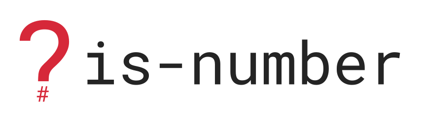
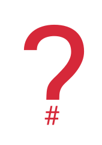

Branding Guidelines
===================

The following guidelines are intended to help create a consistent design for ``is-number`` accross:

 * Project pages
 * Websites
 * Social media

Logo
----

Wide

Icon

Colours
-------

- Primary

  - Crimson (``#D62839``)
  - Bright Maroon (``#BA324F``)

- Secondary

  - Blye Sapphire (``#175676``)
  - Maximum Blue (``#4BA3C3``)
  - Colombia Blue (``#CCE6F4``)
  - Black (``#242424``)

Fonts
-----

  - Titles: Roboto
  - Body: Roboto
  - Code: Inconsolata